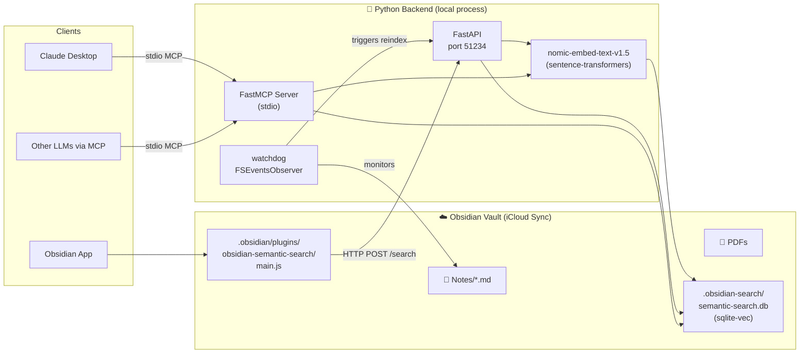
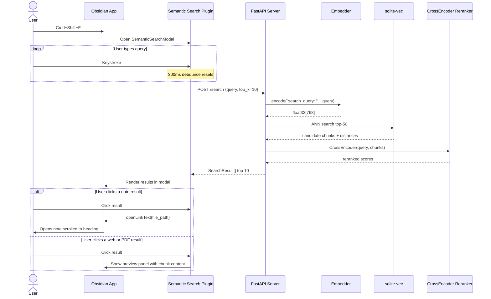
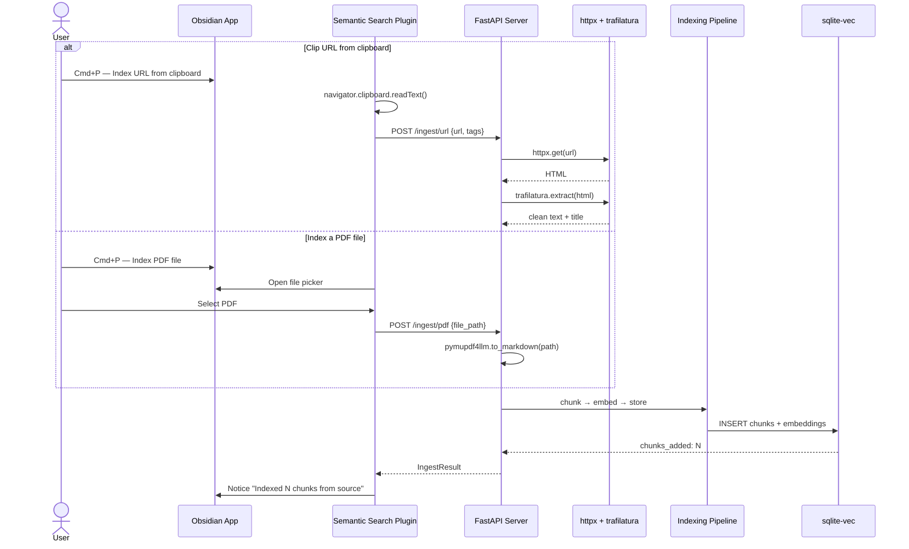
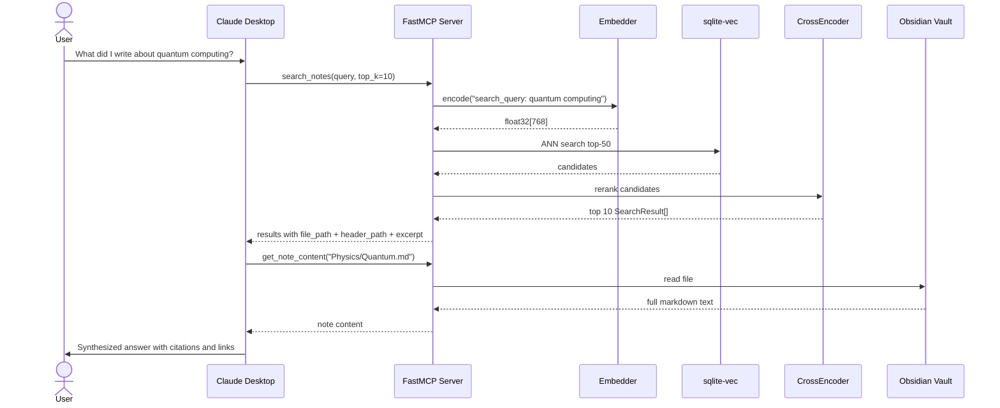
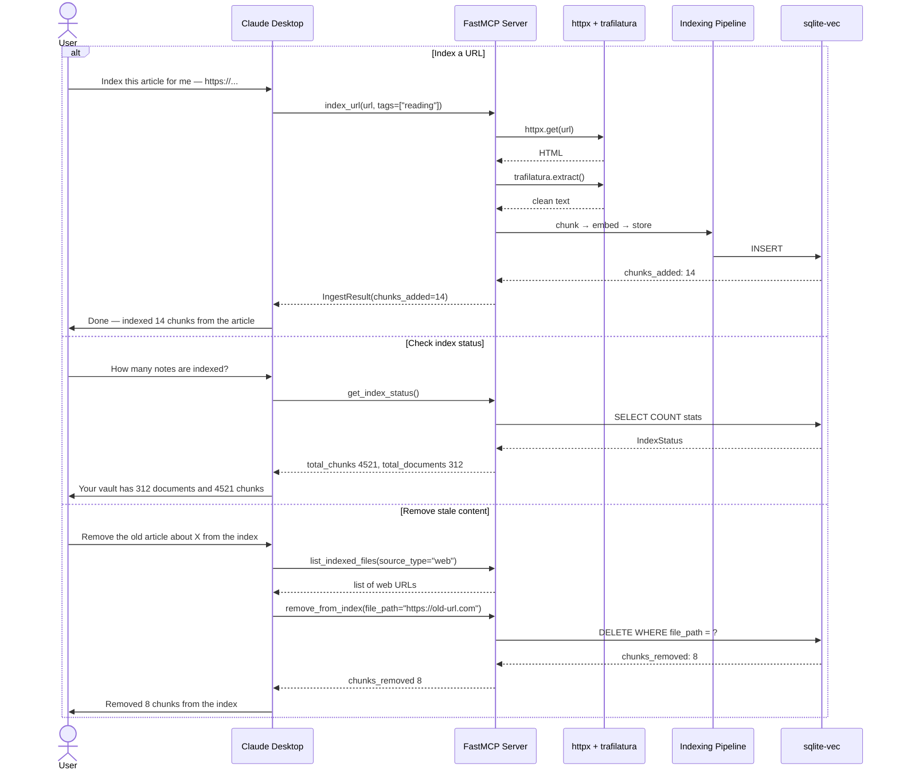
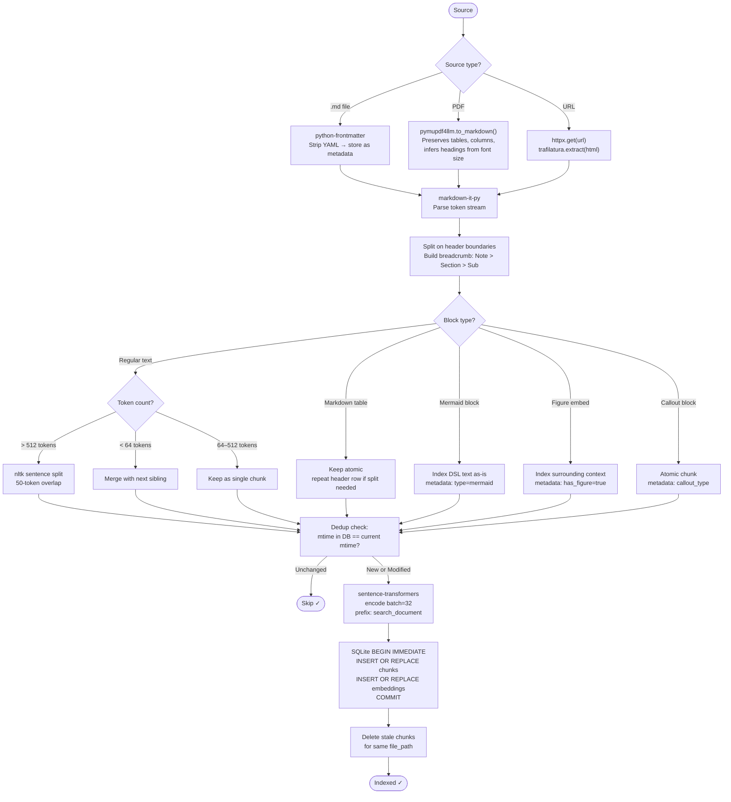
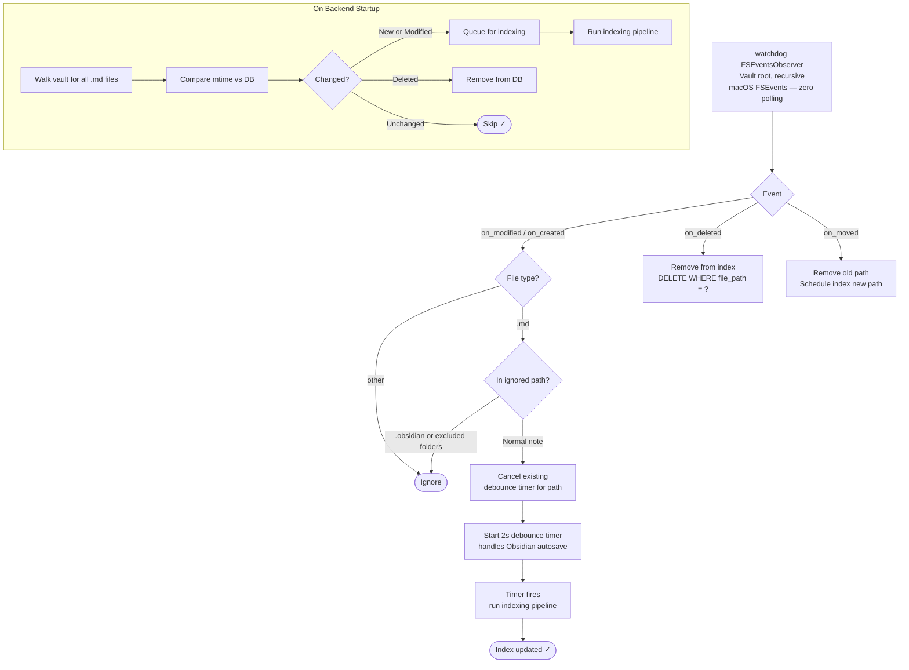

# User Flows

Seven Mermaid diagrams covering every interaction path in the system.

---

## 1. System Architecture

High-level view of all components and how they connect.

---

## 2. Obsidian Plugin — Search Flow

User searches from inside Obsidian via the plugin.

---

## 3. Obsidian Plugin — URL & PDF Ingestion Flow

User clips a web page or indexes a PDF from inside Obsidian.

---

## 4. Claude — MCP Query Flow

User asks Claude a question; Claude searches the vault autonomously.

---

## 5. Claude — Ingestion & Index Management Flow

User asks Claude to index new content or manage the index.

---

## 6. Indexing Pipeline — Content Processing

How any source flows through chunking and storage.

---

## 7. File Watcher — Incremental Reindex Flow

How vault changes trigger automatic reindexing.

