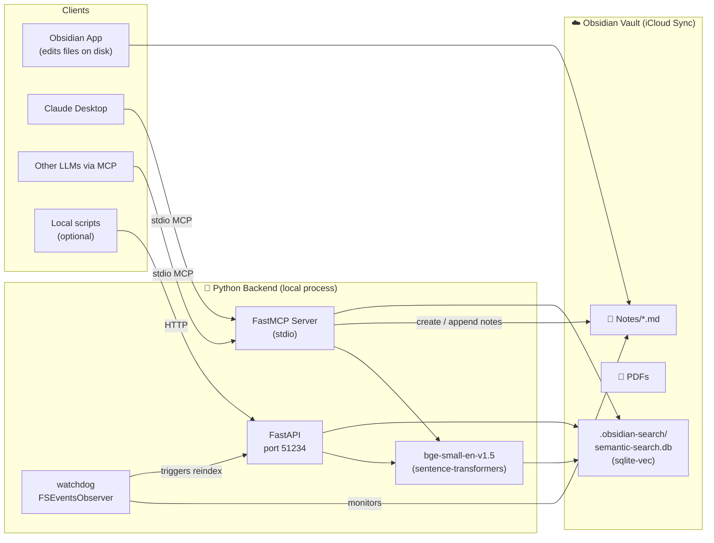
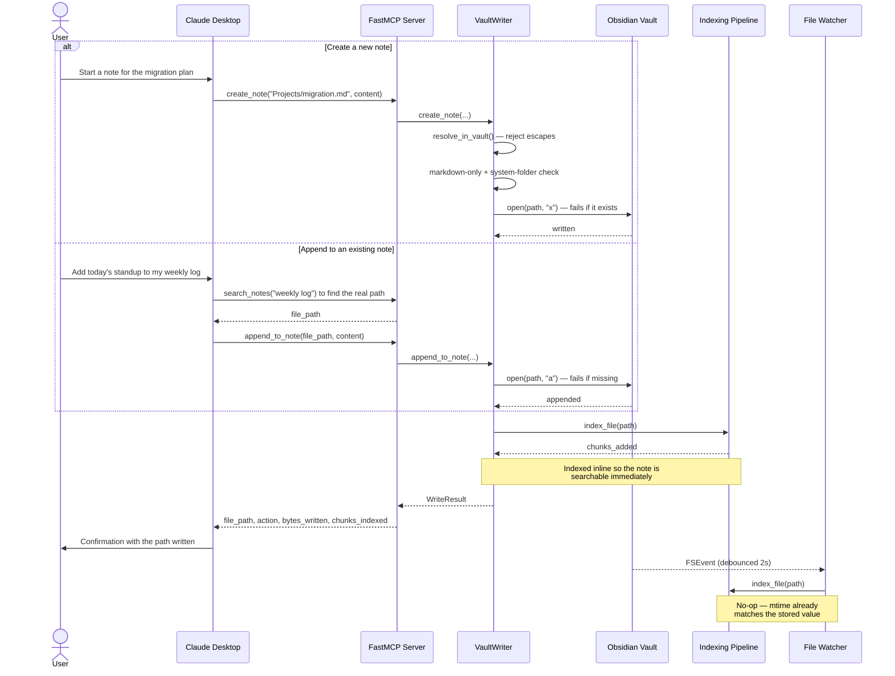
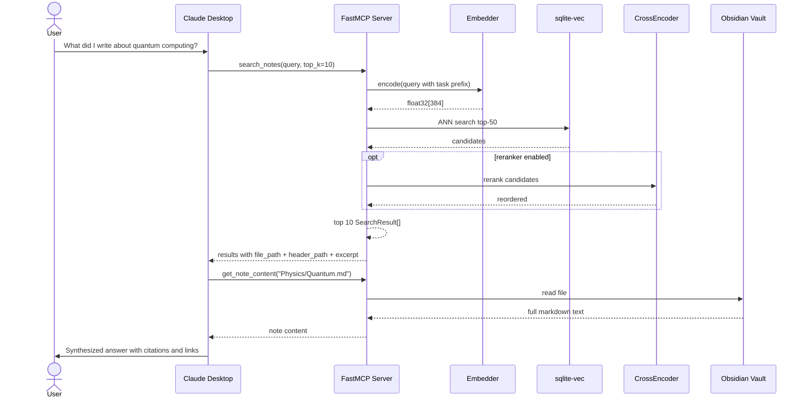
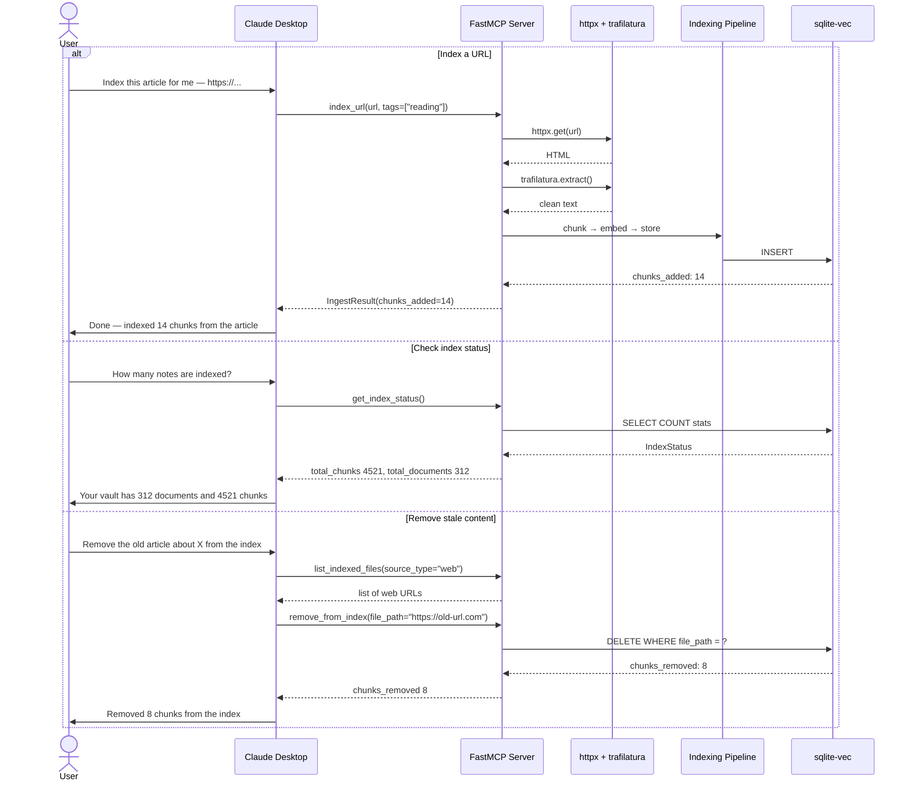
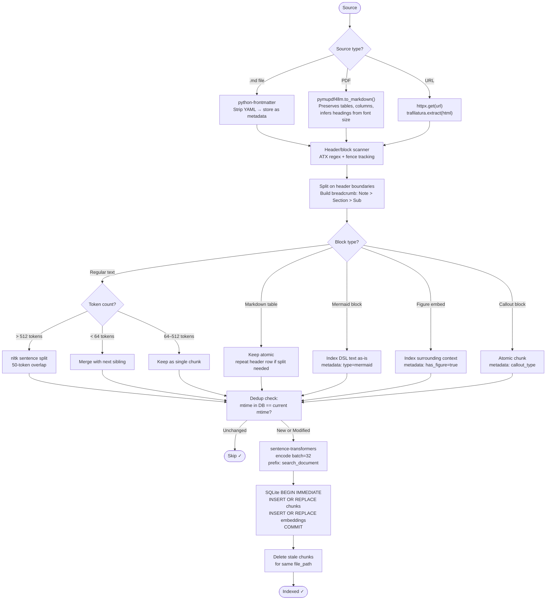
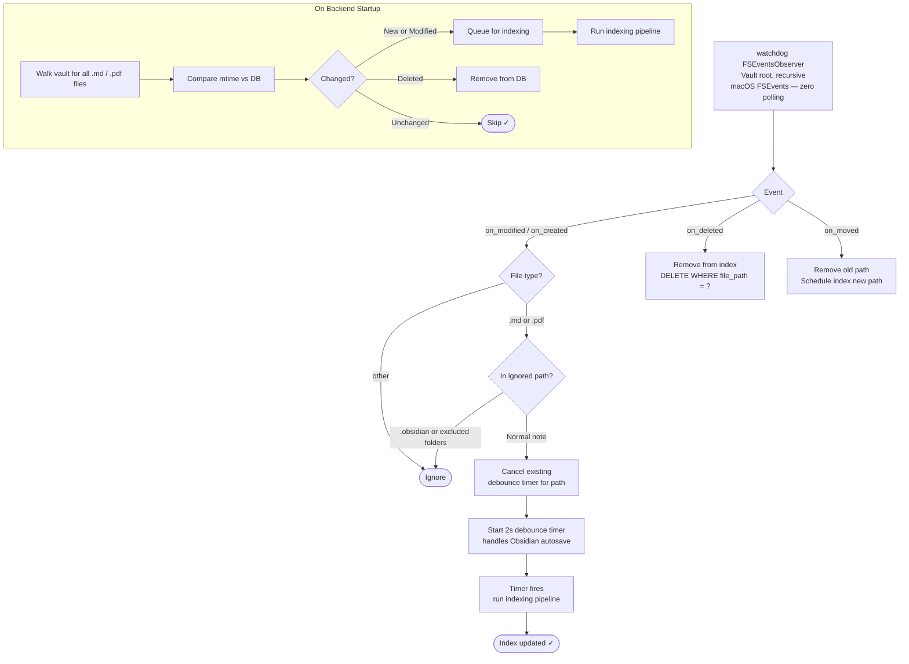

# User Flows

Mermaid diagrams covering every interaction path in the system.

---

## 1. System Architecture

High-level view of all components and how they connect.

```mermaid
graph LR
    subgraph iCloud ["☁️ Obsidian Vault (iCloud Sync)"]
        Notes["📝 Notes/*.md"]
        PDFs["📄 PDFs"]
        DB[".obsidian-search/<br/>semantic-search.db<br/>(sqlite-vec)"]
    end

    subgraph Backend ["🐍 Python Backend (local process)"]
        API["FastAPI<br/>port 51234"]
        MCP_SRV["FastMCP Server<br/>(stdio)"]
        Embedder["bge-small-en-v1.5<br/>(sentence-transformers)"]
        Watcher["watchdog<br/>FSEventsObserver"]
    end

    subgraph Clients ["Clients"]
        Obsidian["Obsidian App<br/>(edits files on disk)"]
        Claude["Claude Desktop"]
        LLMs["Other LLMs via MCP"]
        Scripts["Local scripts<br/>(optional)"]
    end

    Obsidian --> Notes
    Scripts -->|"HTTP"| API
    Claude -->|"stdio MCP"| MCP_SRV
    LLMs -->|"stdio MCP"| MCP_SRV
    API --> Embedder
    MCP_SRV --> Embedder
    MCP_SRV -->|"create / append notes"| Notes
    Embedder --> DB
    Watcher -->|"monitors"| Notes
    Watcher -->|"triggers reindex"| API
    API --> DB
    MCP_SRV --> DB
```

---

## 2. Claude — Vault Write Flow

Claude creates a new note or appends to an existing one. Writes are additive:
`create_note` refuses to touch an existing file and `append_to_note` refuses to
create one, so no tool call can destroy existing writing.

```mermaid
sequenceDiagram
    actor User
    participant Claude as Claude Desktop
    participant MCP as FastMCP Server
    participant Writer as VaultWriter
    participant Vault as Obsidian Vault
    participant Pipeline as Indexing Pipeline
    participant Watcher as File Watcher

    alt Create a new note
        User->>Claude: Start a note for the migration plan
        Claude->>MCP: create_note("Projects/migration.md", content)
        MCP->>Writer: create_note(...)
        Writer->>Writer: resolve_in_vault() — reject escapes
        Writer->>Writer: markdown-only + system-folder check
        Writer->>Vault: open(path, "x") — fails if it exists
        Vault-->>Writer: written
    else Append to an existing note
        User->>Claude: Add today's standup to my weekly log
        Claude->>MCP: search_notes("weekly log") to find the real path
        MCP-->>Claude: file_path
        Claude->>MCP: append_to_note(file_path, content)
        MCP->>Writer: append_to_note(...)
        Writer->>Vault: open(path, "a") — fails if missing
        Vault-->>Writer: appended
    end

    Writer->>Pipeline: index_file(path)
    Pipeline-->>Writer: chunks_added
    Note over Writer,Pipeline: Indexed inline so the note is<br/>searchable immediately
    Writer-->>MCP: WriteResult
    MCP-->>Claude: file_path, action, bytes_written, chunks_indexed
    Claude->>User: Confirmation with the path written

    Vault-->>Watcher: FSEvent (debounced 2s)
    Watcher->>Pipeline: index_file(path)
    Note over Watcher,Pipeline: No-op — mtime already<br/>matches the stored value
```

---

## 3. Claude — MCP Query Flow

User asks Claude a question; Claude searches the vault autonomously.

```mermaid
sequenceDiagram
    actor User
    participant Claude as Claude Desktop
    participant MCP as FastMCP Server
    participant Embed as Embedder
    participant DB as sqlite-vec
    participant Rerank as CrossEncoder
    participant Vault as Obsidian Vault

    User->>Claude: What did I write about quantum computing?

    Claude->>MCP: search_notes(query, top_k=10)
    MCP->>Embed: encode(query with task prefix)
    Embed-->>MCP: float32[384]
    MCP->>DB: ANN search top-50
    DB-->>MCP: candidates
    opt reranker enabled
        MCP->>Rerank: rerank candidates
        Rerank-->>MCP: reordered
    end
    MCP-->>MCP: top 10 SearchResult[]
    MCP-->>Claude: results with file_path + header_path + excerpt

    Claude->>MCP: get_note_content("Physics/Quantum.md")
    MCP->>Vault: read file
    Vault-->>MCP: full markdown text
    MCP-->>Claude: note content

    Claude->>User: Synthesized answer with citations and links
```

---

## 4. Claude — Ingestion & Index Management Flow

User asks Claude to index new content or manage the index.

```mermaid
sequenceDiagram
    actor User
    participant Claude as Claude Desktop
    participant MCP as FastMCP Server
    participant Fetch as httpx + trafilatura
    participant Pipeline as Indexing Pipeline
    participant DB as sqlite-vec

    alt Index a URL
        User->>Claude: Index this article for me — https://...
        Claude->>MCP: index_url(url, tags=["reading"])
        MCP->>Fetch: httpx.get(url)
        Fetch-->>MCP: HTML
        MCP->>Fetch: trafilatura.extract()
        Fetch-->>MCP: clean text
        MCP->>Pipeline: chunk → embed → store
        Pipeline->>DB: INSERT
        DB-->>MCP: chunks_added: 14
        MCP-->>Claude: IngestResult(chunks_added=14)
        Claude->>User: Done — indexed 14 chunks from the article

    else Check index status
        User->>Claude: How many notes are indexed?
        Claude->>MCP: get_index_status()
        MCP->>DB: SELECT COUNT stats
        DB-->>MCP: IndexStatus
        MCP-->>Claude: total_chunks 4521, total_documents 312
        Claude->>User: Your vault has 312 documents and 4521 chunks

    else Remove stale content
        User->>Claude: Remove the old article about X from the index
        Claude->>MCP: list_indexed_files(source_type="web")
        MCP-->>Claude: list of web URLs
        Claude->>MCP: remove_from_index(file_path="https://old-url.com")
        MCP->>DB: DELETE WHERE file_path = ?
        DB-->>MCP: chunks_removed: 8
        MCP-->>Claude: chunks_removed 8
        Claude->>User: Removed 8 chunks from the index
    end
```

---

## 5. Indexing Pipeline — Content Processing

How any source flows through chunking and storage.

```mermaid
flowchart TD
    A([Source]) --> B{Source type?}

    B -->|".md file"| C["python-frontmatter<br/>Strip YAML → store as metadata"]
    B -->|"PDF"| D["pymupdf4llm.to_markdown()<br/>Preserves tables, columns,<br/>infers headings from font size"]
    B -->|"URL"| E["httpx.get(url)<br/>trafilatura.extract(html)"]

    C --> F["Header/block scanner<br/>ATX regex + fence tracking"]
    D --> F
    E --> F

    F --> G["Split on header boundaries<br/>Build breadcrumb: Note > Section > Sub"]

    G --> H{Block type?}

    H -->|"Regular text"| I{Token count?}
    H -->|"Markdown table"| J["Keep atomic<br/>repeat header row if split needed"]
    H -->|"Mermaid block"| K["Index DSL text as-is<br/>metadata: type=mermaid"]
    H -->|"Figure embed"| L["Index surrounding context<br/>metadata: has_figure=true"]
    H -->|"Callout block"| M["Atomic chunk<br/>metadata: callout_type"]

    I -->|"> 512 tokens"| N["nltk sentence split<br/>50-token overlap"]
    I -->|"< 64 tokens"| O["Merge with next sibling"]
    I -->|"64–512 tokens"| P["Keep as single chunk"]

    N --> Q["Dedup check:<br/>mtime in DB == current mtime?"]
    O --> Q
    P --> Q
    J --> Q
    K --> Q
    L --> Q
    M --> Q

    Q -->|"Unchanged"| R(["Skip ✓"])
    Q -->|"New or Modified"| S["sentence-transformers<br/>encode batch=32<br/>prefix: search_document"]

    S --> T["SQLite BEGIN IMMEDIATE<br/>INSERT OR REPLACE chunks<br/>INSERT OR REPLACE embeddings<br/>COMMIT"]
    T --> U["Delete stale chunks<br/>for same file_path"]
    U --> V(["Indexed ✓"])
```

---

## 6. File Watcher — Incremental Reindex Flow

How vault changes trigger automatic reindexing. Obsidian is an ordinary editor
here — it saves files to disk and the watcher notices; nothing is installed into
Obsidian itself.

```mermaid
flowchart TD
    A["watchdog FSEventsObserver<br/>Vault root, recursive<br/>macOS FSEvents — zero polling"] --> B{Event}

    B -->|"on_modified / on_created"| C{File type?}
    B -->|"on_deleted"| D["Remove from index<br/>DELETE WHERE file_path = ?"]
    B -->|"on_moved"| E["Remove old path<br/>Schedule index new path"]

    C -->|".md or .pdf"| F{In ignored path?}
    C -->|"other"| G(["Ignore"])

    F -->|".obsidian or excluded folders"| G
    F -->|"Normal note"| H["Cancel existing<br/>debounce timer for path"]

    H --> I["Start 2s debounce timer<br/>handles Obsidian autosave"]
    I --> J["Timer fires<br/>run indexing pipeline"]
    J --> K(["Index updated ✓"])

    subgraph Startup ["On Backend Startup"]
        S1["Walk vault for all .md / .pdf files"] --> S2["Compare mtime vs DB"]
        S2 --> S3{Changed?}
        S3 -->|"New or Modified"| S4["Queue for indexing"]
        S3 -->|"Deleted"| S5["Remove from DB"]
        S3 -->|"Unchanged"| S6(["Skip ✓"])
        S4 --> S7["Run indexing pipeline"]
    end
```
